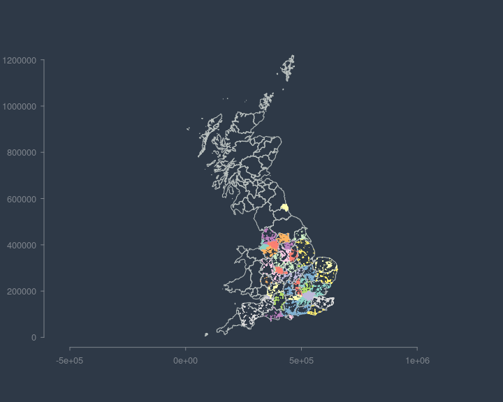

sfurrr
================

<!-- badges: start -->

[](https://lifecycle.r-lib.org/articles/stages.html#experimental)

<!-- badges: end -->

An experimental R package to parallelise some functions from the
excellent {sf} package using the also brilliant {furrr} package. Right
now it’s just parallel versions of `st_join` and
`st_filter`<https://r-spatial.github.io/sf/reference/st_join.html>. They
won’t always help and will often be slower but sometimes it might be
useful. This is just messing about right now tbh. The code is
deliberately copied from {sf} and {furrr} so that it can be used as a
drop in replacement.

I’ve added [{geoarrow}](https://github.com/paleolimbot/geoarrow) as a
dependency to play with using it to pass data between cores - it seems
to be fractionally faster… make sure to install {arrow} if you want to
try this out.

## Install

    # install.packages("remotes")
    remotes::install_github('h-a-graham/sfurrr')

## Examples…

So here is the some data included in the package - it is the English
cycle network from Open Street Map (downloaded with
[{osmextract}](https://docs.ropensci.org/osmextract/)) and British
counties from [Ordnance
survey](https://osdatahub.os.uk/downloads/open/BoundaryLine).

``` r
library(sfurrr)
library(ggplot2)

ggplot(cycleways_england)+
  geom_sf(colour='#39C173')+
  geom_sf(data=gb_counties, fill=NA, colour='grey30') +
  theme_bw()
```

<!-- -->

``` r
summary(cycleways_england)
```

    ##     osm_id            highway                   geometry     
    ##  Length:105184      Length:105184      LINESTRING   :105184  
    ##  Class :character   Class :character   epsg:27700   :     0  
    ##  Mode  :character   Mode  :character   +proj=tmer...:     0

``` r
summary(gb_counties)
```

    ##      Name           Area_Description            geometry 
    ##  Length:91          Length:91          MULTIPOLYGON :91  
    ##  Class :character   Class :character   epsg:27700   : 0  
    ##  Mode  :character   Mode  :character   +proj=tmer...: 0

### Spatial Joins

Now, let’s say we want to do a spatial join between the cycleways and
the counties so we attach the county data to the cycleway network. This
might allow us to do some summarised stats on the cycle network of
different counties, for example.

So let’s do this with {sf} which is loaded by default with {sfurr}.
Let’s also get some timings with {tictoc}

``` r
library(tictoc)

tic()
join.sf <-  st_join(cycleways_england,
                  gb_counties)
toc()
```

    ## 9.013 sec elapsed

``` r
tic()
join.sfurr <-  future_st_join(cycleways_england,
                  gb_counties)
toc()
```

    ## 16.913 sec elapsed

Okay.. so {sf} is actually a lot faster?! Yes, using the simple
st_intersect with a left join (default) is pretty speedy already with
{sf}. But what about more costly spatial operations? Let’s try now with
the option `largest=TRUE` which joins based on the largest amount of
intersection.

``` r
# ------------ `st_join` ----------------
tic()
joinL.sf <-  st_join(cycleways_england,
                  gb_counties, largest=TRUE)
toc()
```

    ## 154.848 sec elapsed

``` r
# ------------ `future_st_join` ----------------
tic()
joinL.sfurr <-  future_st_join(cycleways_england,
                  gb_counties, largest=TRUE)
toc()
```

    ## 46.467 sec elapsed

Okay so now we see that going parallel does indeed offer some potential
uses when using a costly spatial function.

### Spatial filtering

Once again, here is a comparison of the simplest approach with th
`st_intersect` spatial predicate.

``` r
# ------------ `st_fiter` ----------------
tic()
filt_t1 <- st_filter(cycleways_england['highway'],
                     gb_counties[1:50,])
toc()
```

    ## 8.131 sec elapsed

``` r
# ----------- `future_st_filter` -----------------
tic()
filt_t2 <- future_st_filter(cycleways_england['highway'],
                            gb_counties[1:50,])
toc()
```

    ## 21.13 sec elapsed

No surprises, {sf} is faster again. But, what about a more costly
operation. Let’s use the `st_within` spatial predicate to filter out
cycleways that are not located entirely within the county areas… This is
kind of pointless for this use case and is just illustrative really…

``` r
# ------------ `st_fiter` ----------------
tic()
within_filt_t1 <- st_filter(joinL.sfurr,
                     gb_counties[1:50,], .predicate = st_within)
toc()
```

    ## 55.333 sec elapsed

``` r
# ----------- `future_st_filter` -----------------
tic()
within_filt_t2 <- future_st_filter(joinL.sfurr,
                            gb_counties[1:50,], .predicate = st_within)
toc()
```

    ## 26.821 sec elapsed

Cool, so in this case it is faster!

## Summary

This is not a globally useful idea but in some cases, when using very
large spatial datasets, you may get a speed up by running spatial
filters/joins in parallel. Any speed up will depend on the number of
processes you can run; by default, {sfurrr} uses all available cores but
in many cases this is overkill…

``` r
ggplot(within_filt_t2)+
  geom_sf(aes(colour=Name), show.legend=FALSE)+
  geom_sf(data=gb_counties, fill=NA, colour='grey30') +
  theme_bw()
```

<!-- -->
